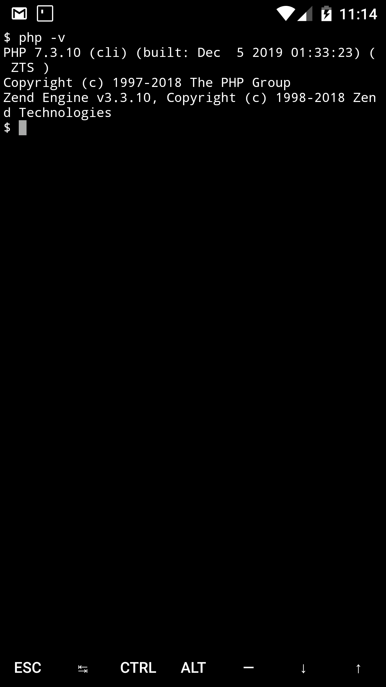
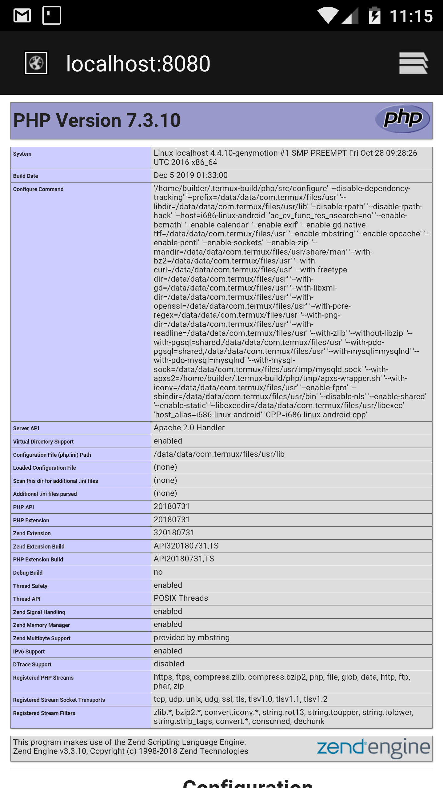

Repositori untuk setup PHP dan Apache2 di android menggunakan Termux. Untuk tutorial lengkapnya silahkan lihat di youtube saya (https://youtube.com/@Barril_Dev)

## Instalasi
Untuk instalasi php dan apache2. Buka termux, lalu run command ini:

```
pkg install git -y && cd ~/ && git clone https://github.com/BarrilEuyy/ && cd ~/install-localhost && bash setup && cd ~/
```
## Test Instalasi
Cek versi php:
```
php -v
```


Untuk menguji apakah PHP bisa  dirunning. Buat file index.php:
```
echo "<?php phpinfo();?>" > storage/shared/htdocs/index.php
```

start server:
```
apachectl
```


